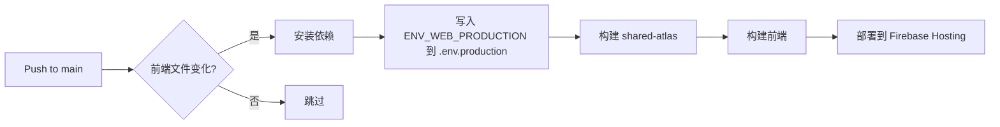
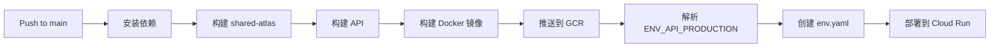

# GitHub Workflows 配置说明

本目录包含所有的 CI/CD 工作流配置。

## 工作流列表

### 1. 前端部署 - Firebase Hosting
**文件**: [workflows/deploy-firebase-prod.yml](workflows/deploy-firebase-prod.yml)

- **触发条件**: 推送到 `main` 分支，且以下路径有变化
  - `apps/web/**`
  - `packages/shared-atlas/**`
  - `.github/workflows/deploy-firebase-prod.yml`

- **部署目标**: Firebase Hosting
- **构建流程**:
  1. 安装依赖
  2. 构建共享包 (`@tainiex/shared-atlas`)
  3. 构建前端 (`@tainiex/web`)
  4. 部署到 Firebase

- **所需 Secrets**:
  - `ENV_WEB_PRODUCTION` - 前端环境变量（.env 格式）
  - `GCP_SA_KEY` - Google Cloud 服务账号密钥
  - `GCP_PROJECT_ID` - GCP 项目 ID

### 2. 后端部署 - Cloud Run
**文件**: [workflows/deploy-cloudrun-prod.yml](workflows/deploy-cloudrun-prod.yml)

- **触发条件**: 推送到 `main` 分支

- **部署目标**: Google Cloud Run
- **构建流程**:
  1. 安装依赖
  2. 构建共享包和 API
  3. 构建 Docker 镜像
  4. 推送到 GCR
  5. 部署到 Cloud Run

- **所需 Secrets**:
  - `ENV_API_PRODUCTION` - 后端环境变量（.env 格式）
  - `GCP_SA_KEY` - Google Cloud 服务账号密钥
  - `GCP_PROJECT_ID` - GCP 项目 ID
  - `CLOUD_RUN_GCP_SERVICE_ACCOUNT` - Cloud Run 服务账号邮箱

## Secrets 配置指南

### 快速配置

1. 前往仓库的 **Settings** → **Secrets and variables** → **Actions**
2. 点击 **New repository secret**
3. 按照 [ENV_SECRETS_TEMPLATE.md](ENV_SECRETS_TEMPLATE.md) 中的模板配置以下 secrets：
   - `ENV_WEB_PRODUCTION`
   - `ENV_API_PRODUCTION`
   - `GCP_SA_KEY`
   - `GCP_PROJECT_ID`
   - `CLOUD_RUN_GCP_SERVICE_ACCOUNT`

### 环境变量格式

使用标准的 `.env` 格式，每行一个变量：

```env
KEY1=value1
KEY2=value2
KEY3=value3
```

**注意事项**:
- 每行一个变量
- 使用 `KEY=VALUE` 格式
- 不需要引号（除非值本身包含空格）
- 不支持注释（`#` 开头的行会被忽略）

## 工作流工作原理

### 前端部署流程



### 后端部署流程



## 并行部署

当同时修改前端和后端代码时，两个工作流会**并行执行**，互不影响：

```
Push to main
    ├─> [并行] 前端工作流 → Firebase Hosting
    └─> [并行] 后端工作流 → Cloud Run
```

## 故障排查

### 部署失败

1. **查看日志**: 前往 **Actions** 标签页，点击失败的工作流查看详细日志
2. **检查 Secrets**: 确保所有必需的 secrets 都已正确配置
3. **验证格式**: 确保 `ENV_WEB_PRODUCTION` 和 `ENV_API_PRODUCTION` 使用正确的 `.env` 格式

### 环境变量未生效

- **前端**: 确保变量以 `VITE_` 开头
- **后端**: 确保 `env.yaml` 正确生成（查看部署日志）

### GCP 认证失败

- 检查 `GCP_SA_KEY` 是否为有效的 JSON 格式
- 确认服务账号具有必要的权限：
  - Firebase Admin
  - Cloud Run Admin
  - Storage Admin

## 本地测试

### 测试前端构建

```bash
# 在项目根目录
export $(cat apps/web/.env.production | xargs)
pnpm --filter @tainiex/web build
```

### 测试后端构建

```bash
# 在项目根目录
pnpm --filter @tainiex/api build
docker build -t tainiex-atlas .
```

## 手动部署

### 前端

```bash
# 确保已登录 Firebase
firebase login

# 部署
pnpm deploy:web
```

### 后端

```bash
# 确保已登录 GCP
gcloud auth login

# 构建并推送
pnpm deploy:api
docker push gcr.io/PROJECT_ID/tainiex-atlas:TAG

# 部署到 Cloud Run
gcloud run deploy tainiex-atlas \
  --image gcr.io/PROJECT_ID/tainiex-atlas:TAG \
  --region us-central1
```

## 安全最佳实践

1. ✅ **使用环境变量** - 永远不要在代码中硬编码敏感信息
2. ✅ **最小权限原则** - 服务账号只授予必要的权限
3. ✅ **定期轮换密钥** - 定期更新 JWT secrets 和 API keys
4. ✅ **监控访问日志** - 定期检查 GCP 和 GitHub 的审计日志
5. ✅ **环境隔离** - 生产和开发使用不同的密钥和资源

## 相关文档

- [前端部署文档](../apps/web/DEPLOYMENT.md)
- [Secrets 配置模板](ENV_SECRETS_TEMPLATE.md)
- [GitHub Actions 文档](https://docs.github.com/en/actions)
- [Firebase Hosting 文档](https://firebase.google.com/docs/hosting)
- [Cloud Run 文档](https://cloud.google.com/run/docs)
