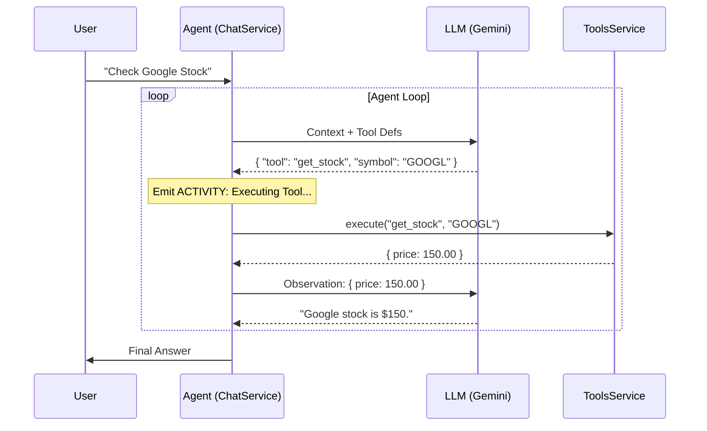

# arch-design-001: System Architecture & Agentic Workflow / 系统架构与智能体工作流

> **Author / 作者**: AI Assistant
> **Date / 日期**: 2026-01-23
> **Status / 状态**: Implemented (已实现)

## 1. Overview / 概览

**Tainiex Atlas** is a modern, agentic AI platform designed to bridge the gap between static LLM chats and dynamic tool execution. It features a robust backend built with NestJS, a real-time WebSocket gateway, and an autonomous agent loop capable of reasoning and acting.

**Tainiex Atlas** 是一个现代化的智能体 AI 平台，旨在弥合静态 LLM 聊天与动态工具执行之间的鸿沟。它拥有基于 NestJS 构建的强大后端、实时 WebSocket 网关，以及能够进行推理和行动的自主智能体循环。

### High-Level Architecture / 高层架构

```mermaid
graph TD
    Client[Client (React/Next.js)] <-->|WebSocket/HTTP| Gateway[API Gateway (NestJS)]
    
    subgraph "Backend Services"
        Gateway --> Auth[Auth Service (JWT)]
        Gateway --> Chat[Chat Service]
        Gateway --> Activity[Activity Service (Pub/Sub)]
        
        Chat --> Agent[Agentic Workflow (ReAct)]
        Agent --> LLM[LLM Service (Gemini/Vertex)]
        Agent --> Tools[Tools Service]
        
        Tools --> Weather[Weather API]
        Tools --> Search[Google Search]
        Tools --> Wiki[Wikipedia]
    end
    
    Chat --> DB[(PostgreSQL/TypeORM)]
```

---

## 2. Core Modules / 核心模块

### 2.1 Activity Gateway (Real-time Layer) / 活动网关 (实时层)
*   **Role**: Manages real-time connections, establishing a "Session" for users.
*   **Security**: Secured via JWT Middleware. Connections are strictly rejected if unauthenticated (Hard Reject).
*   **Function**: Broadcasts agent activities (e.g., "Thinking...", "Calling Weather Tool") to the frontend.

*   **角色**: 管理实时连接，为用户建立 "会话"。
*   **安全性**: 通过 JWT 中间件保护。未认证连接会被严格拒绝 (硬拒绝)。
*   **功能**: 向前端广播智能体活动（例如 "思考中..."、"正在调用天气工具"）。

### 2.2 Chat Service (The Brain) / 聊天服务 (大脑)
*   **Role**: Handles message persistence, context management, and the **Agent Loop**.
*   **Logic**: Implements the ReAct (Reason + Act) pattern.
*   **Storage**: Uses PostgreSQL to store Sessions, Messages, and History.

*   **角色**: 处理消息持久化、上下文管理以及 **智能体循环**。
*   **逻辑**: 实现 ReAct (推理 + 行动) 模式。
*   **存储**: 使用 PostgreSQL 存储会话、消息和历史记录。

### 2.3 Tools Service (The Hands) / 工具服务 (手)
*   **Role**: A registry of executable tools.
*   **Capabilities**:
    *   `get_weather`: Fetch real-time weather.
    *   `web_search`: Search the internet.
    *   `search_wikipedia`: Query encyclopedic knowledge.
    *   `get_stock_price`: Fetch financial data.
*   **Architecture**: Modular provider pattern. New tools can be added by extending the abstract `Tool` class.

*   **角色**: 可执行工具的注册表。
*   **能力**:
    *   `get_weather`: 获取实时天气。
    *   `web_search`: 搜索互联网。
    *   `search_wikipedia`: 查询百科知识。
    *   `get_stock_price`: 获取金融数据。
*   **架构**: 模块化提供者模式。通过继承抽象 `Tool` 类可轻松添加新工具。

---

## 3. Agentic Workflow (ReAct) / 智能体工作流

The core innovation of Tainiex Atlas is the move from a passive chatbot to an active agent.
Tainiex Atlas 的核心创新在于从被动聊天机器人向主动智能体的转变。

### The Loop / 循环流程

1.  **Input**: User sends "What's the weather in Tokyo?"
2.  **Planning (LLM)**: The Agent (using `gemini-2.5-flash`) analyzes the request and sees it matches the `get_weather` tool definition.
3.  **Decision**: It outputs a structured JSON call: `{ "tool": "get_weather", "parameters": { "city": "Tokyo" } }`.
4.  **Execution**: `ToolsService` executes the function.
5.  **Observation**: The result `{"temp": 22, "desc": "Cloudy"}` is properly formatted and fed back to the LLM.
6.  **Synthesis**: The LLM reads the observation and generates the final answer: "It is currently 22°C and cloudy in Tokyo."

1.  **输入**: 用户发送 "东京天气怎么样？"
2.  **规划 (LLM)**: 智能体 (使用 `gemini-2.5-flash`) 分析请求，发现匹配 `get_weather` 工具定义。
3.  **决策**: 输出结构化 JSON 调用: `{ "tool": "get_weather", "parameters": { "city": "Tokyo" } }`。
4.  **执行**: `ToolsService` 执行该函数。
5.  **观察**: 结果 `{"temp": 22, "desc": "Cloudy"}` 被格式化并回填给 LLM。
6.  **合成**: LLM 读取观察结果，生成最终回答: "东京当前气温 22°C，多云。"

### Activity Sequence / 活动时序图



---

## 4. Security / 安全性

### Authentication / 认证
*   **JWT**: All requests (HTTP & WebSocket) require a valid JSON Web Token.
*   **Hard Rejection**: The `ActivityGateway` implements a middleware that disconnects unauthenticated sockets immediately at the handshake phase.

*   **JWT**: 所有请求 (HTTP 和 WebSocket) 都需要有效的 JSON Web Token。
*   **硬拒绝**: `ActivityGateway` 实现了中间件，在握手阶段立即断开未认证的 Socket 连接。

### Context / 上下文
*   **CLS (Continuation Local Storage)**: `ClsService` ensures that User Context (User ID, Trace ID) is propagated through the async call chain (Controller -> Service -> Tool), enabling unified logging and security checks.

*   **CLS (持续本地存储)**: `ClsService` 确保用户上下文 (User ID, Trace ID) 在异步调用链 (Controller -> Service -> Tool) 中传递，实现统一的日志记录和安全检查。

---

## 5. Future Roadmap / 未来规划

*   **Memory Distillation**: Summarize long conversations into long-term memory.
*   **Multi-Agent Collaboration**: Multiple specialized agents working together.
*   **Human-in-the-loop**: User approval for sensitive tool actions (e.g., "Send Email").

*   **记忆提取**: 将长对话总结为长期记忆。
*   **多智能体协作**: 多个专用智能体协同工作。
*   **人机回环**: 对敏感工具操作 (如 "发送邮件") 进行用户审批。
