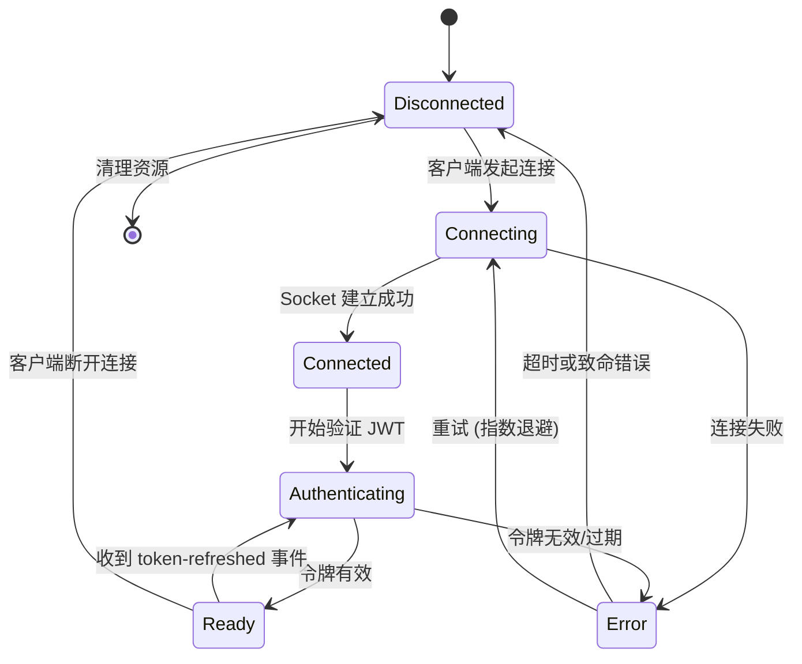

# arch-design-002: WebSocket 状态机架构

> **作者**: AI Assistant  
> **创建日期**: 2026-01-22  
> **状态**: 计划中 (Planned)

## 问题陈述

当前 `ChatGateway` 和 `CollaborationGateway` 的 WebSocket 连接状态管理存在以下问题：

1. **复杂的嵌套逻辑**: `handleConnection` 方法包含多层 if-else 嵌套，处理认证、限流、令牌提取等多个关注点
2. **隐式状态追踪**: 通过 `client.user` 是否存在来隐式判断认证状态，缺乏明确的状态定义
3. **缺少中间状态**: 没有显式的 "认证中"、"连接中" 等中间状态，难以追踪连接生命周期
4. **重连逻辑分散**: 客户端断线重连、令牌刷新等逻辑分散在多个方法中，缺乏统一管理
5. **测试困难**: 状态转换逻辑与业务逻辑耦合，难以单独测试状态机逻辑

## 解决方案

引入 **XState** 状态机库来统一管理 WebSocket 连接的生命周期状态。

### 为什么选择 XState？

| 特性 | XState | Robot (备选) |
|------|---------|--------------|
| **复杂状态管理** | ✅ 支持层级状态、并行状态、历史状态 | ❌ 仅支持简单 FSM |
| **可视化工具** | ✅ 内置可视化调试器 | ❌ 需要外部工具 |
| **异步操作** | ✅ 原生支持（invoke、actors） | ⚠️ 需要自定义逻辑 |
| **TypeScript 支持** | ✅ 完整类型推断 | ✅ 完整类型推断 |
| **打包体积** | ⚠️ 16.7 kB (gzip) | ✅ 1.2 kB (gzip) |
| **重连策略** | ✅ 内置指数退避 | ❌ 需要手动实现 |

**结论**: XState 更适合处理 WebSocket 这种复杂的、有多个异步操作的场景。

## 状态机设计

### 状态定义



### 状态说明

| 状态 | 描述 | 允许的操作 |
|------|------|------------|
| `Disconnected` | 初始状态，客户端未连接 | 等待连接 |
| `Connecting` | 正在建立 WebSocket 连接 | 等待握手完成 |
| `Connected` | Socket 已建立，但未认证 | 提取并验证令牌 |
| `Authenticating` | 正在验证 JWT 令牌 | 等待验证结果 |
| `Ready` | 已认证，可以收发消息 | 处理业务事件 (chat:send, note:join 等) |
| `Error` | 发生错误 | 决定重试或断开 |

### 事件定义

```typescript
type WebSocketMachineEvent =
  | { type: 'CONNECT'; client: AuthenticatedSocket }
  | { type: 'CONNECTION_ESTABLISHED' }
  | { type: 'AUTH_SUCCESS'; user: JwtPayload }
  | { type: 'AUTH_FAILED'; error: string }
  | { type: 'TOKEN_REFRESHED'; newToken: string }
  | { type: 'DISCONNECT'; reason?: string }
  | { type: 'RETRY' }
  | { type: 'FATAL_ERROR'; error: Error };
```

### 守卫 (Guards)

守卫用于条件判断，决定是否允许状态转换：

```typescript
const guards = {
  // 检查是否超过重试次数
  canRetry: (context) => context.retryCount < MAX_RETRIES,
  
  // 检查是否通过限流
  isRateLimitAllowed: (context) => 
    rateLimitService.isAllowed(context.ip, 50, 60),
  
  // 检查令牌是否即将过期
  isTokenExpiring: (context) => {
    const expiresIn = context.tokenExpiresAt - Date.now();
    return expiresIn < 5 * 60 * 1000; // 5 分钟
  },
};
```

### 动作 (Actions)

动作是状态转换时的副作用：

```typescript
const actions = {
  // 提取并验证 JWT
  authenticateClient: async (context, event) => {
    const token = extractToken(event.client);
    const payload = await jwtService.verifyAsync(token);
    return { type: 'AUTH_SUCCESS', user: payload };
  },
  
  // 发送令牌过期警告
  notifyTokenExpiring: (context) => {
    context.client.emit('auth:token-expiring', {
      expiresIn: context.tokenExpiresAt - Date.now(),
    });
  },
  
  // 指数退避重连
  scheduleRetry: (context) => {
    const delay = Math.min(1000 * Math.pow(2, context.retryCount), 30000);
    setTimeout(() => send({ type: 'RETRY' }), delay);
  },
  
  // 清理资源
  cleanup: (context) => {
    tokenLifecycleService.clearTimer(context.client.id);
    healthService.onDisconnect(context.client.id);
  },
};
```

## 集成方案

### 1. 创建状态机服务

```typescript
// src/common/websocket/websocket-state-machine.service.ts

import { Injectable } from '@nestjs/common';
import { createMachine, interpret } from 'xstate';

@Injectable()
export class WebSocketStateMachineService {
  createMachine(client: AuthenticatedSocket) {
    return createMachine({
      id: `websocket-${client.id}`,
      initial: 'connecting',
      context: {
        client,
        user: null,
        retryCount: 0,
        tokenExpiresAt: null,
      },
      states: {
        // ... 状态定义见上文
      },
    });
  }
}
```

### 2. 在 Gateway 中使用

**Before (当前实现)**:

```typescript
async handleConnection(client: AuthenticatedSocket) {
  // 160+ 行嵌套逻辑
  try {
    const isAllowed = this.rateLimitService.isAllowed(...);
    if (!isAllowed) { ... }
    
    const token = this.extractToken(client);
    if (!token) { ... }
    
    const payload = await this.jwtService.verifyAsync(token);
    if (!payload) { ... }
    
    // ...
  } catch (error) { ... }
}
```

**After (状态机重构)**:

```typescript
async handleConnection(client: AuthenticatedSocket) {
  const machine = this.stateMachineService.createMachine(client);
  const service = interpret(machine);
  
  // 订阅状态变化
  service.onTransition((state) => {
    this.logger.log(`State: ${state.value}`);
    
    if (state.matches('error')) {
      client.emit('error', state.context.error);
    }
    
    if (state.matches('ready')) {
      this.logger.log(`User ${state.context.user.sub} authenticated`);
      client.data.user = state.context.user;
    }
  });
  
  service.start();
  service.send({ type: 'CONNECT', client });
  
  // 存储 service 以便后续使用
  this.machineRegistry.set(client.id, service);
}
```

### 3. 响应事件

```typescript
@SubscribeMessage('auth:token-refreshed')
async handleTokenRefreshed(client: AuthenticatedSocket, payload: { newToken: string }) {
  const service = this.machineRegistry.get(client.id);
  service.send({ type: 'TOKEN_REFRESHED', newToken: payload.newToken });
}
```

## 优势

### 1. 清晰的状态可视化

使用 XState Visualizer 可以实时查看状态转换。在开发环境中启用 `@xstate/inspect`，可以：

- **实时状态图**: 查看当前状态和可能的转换路径
- **事件追踪**: 记录每个发送的事件及其载荷
- **上下文检查**: 查看状态机上下文数据的变化
- **时间旅行**: 回放历史状态转换，便于调试

> **提示**: 安装 XState VSCode 扩展可在编辑器中直接可视化状态机定义。

### 2. 类型安全

TypeScript 可以推断所有可能的状态和事件：

```typescript
// ✅ 类型安全
if (state.matches('ready')) {
  state.context.user.sub; // user 一定存在
}

// ❌ 编译错误
if (state.matches('connecting')) {
  state.context.user.sub; // TypeScript 错误：user 可能为 null
}
```

### 3. 简化测试

```typescript
it('should transition to Ready when auth succeeds', () => {
  const machine = createMachine(...);
  const state = machine.transition('authenticating', { 
    type: 'AUTH_SUCCESS', 
    user: mockUser 
  });
  
  expect(state.value).toBe('ready');
  expect(state.context.user).toEqual(mockUser);
});
```

### 4. 统一的重连逻辑

指数退避重连自动处理，不需要在多处重复实现。

## 实施步骤

1. ✅ **设计状态机** (本文档)
2. ⏳ **安装依赖**: `pnpm add xstate @xstate/inspect`
3. ⏳ **实现状态机服务**: 创建 `websocket-state-machine.service.ts`
4. ⏳ **重构 ChatGateway**: 用状态机替换现有逻辑
5. ⏳ **重构 CollaborationGateway**: 复用状态机
6. ⏳ **编写单元测试**: 测试所有状态转换
7. ⏳ **端到端测试**: 验证向后兼容性
8. ⏳ **文档更新**: 更新 README 和 AGENTS 文档

## 向后兼容性

**保证**: 所有现有的 WebSocket 事件和载荷格式保持不变。

- ✅ `chat:send` → `chat:stream`
- ✅ `note:join` → `yjs:sync`
- ✅ `auth:token-refreshed`
- ✅ `message:ack`

客户端代码**无需任何修改**。

## 性能影响

- **内存**: 每个连接约增加 2-3 KB（状态机实例）
- **CPU**: 状态转换开销可忽略（< 1ms）
- **打包体积**: 增加 16.7 KB (gzip)

对于典型场景（1000 并发连接），额外内存占用约 2-3 MB，可接受。

## 参考资料

- [XState 官方文档](https://stately.ai/docs/xstate)
- [WebSocket 状态管理最佳实践](https://github.com/statelyai/xstate/discussions/2945)
- [NestJS + XState 集成示例](https://github.com/mattpocock/xstate-catalogue/tree/main/examples/nestjs)

---

**审核**: 待用户审核后标记为"已批准"(Approved)
