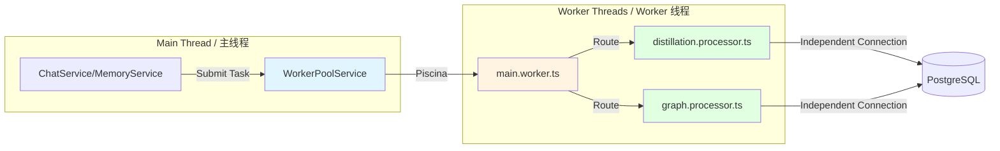
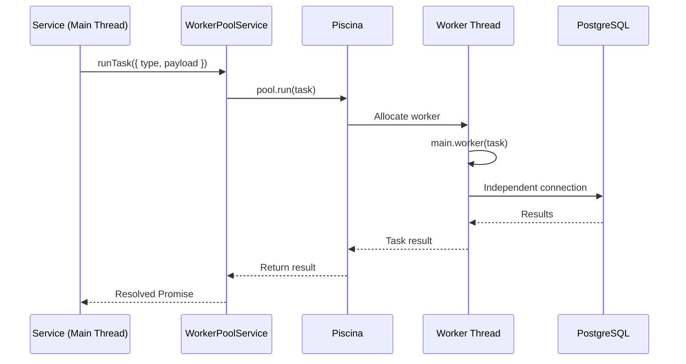

# arch-design-004: Worker Pool Architecture / Worker 池架构

> **Author / 作者**: AI Assistant  
> **Date / 日期**: 2026-01-24  
> **Status / 状态**: Implemented (已实现)

## Problem Statement / 问题陈述

CPU-intensive tasks (knowledge graph extraction, memory distillation, large-scale backfill processing) block the Node.js event loop, causing API latency spikes and degraded user experience.

CPU 密集型任务（知识图谱提取、记忆提炼、大规模回填处理）会阻塞 Node.js 事件循环，导致 API 延迟激增和用户体验下降。

**Impact / 影响**:
- Graph processing: 500ms+ per request (blocking)
- Memory distillation: 1-2s per conversation (blocking)
- Backfill processing: 10s+ for 100 messages (blocking)

---

## Solution: Generic Worker Pool / 解决方案：通用 Worker 池

Use **Piscina** (a robust Node.js worker pool library) to offload heavy processing to separate worker threads.

使用 **Piscina**（一个强大的 Node.js worker 池库）将繁重的处理任务分流到独立的 worker 线程。

### Why Piscina? / 为什么选择 Piscina？

| Feature / 特性 | Piscina | Native worker_threads |
|----------------|---------|----------------------|
| **Thread Pool** | ✅ Automatic management | ❌ Manual implementation |
| **Load Balancing** | ✅ Built-in | ❌ Manual |
| **Error Handling** | ✅ Robust retry logic | ⚠️ Basic |
| **Performance** | ✅ Optimized task queue | ⚠️ Depends on implementation |
| **TypeScript** | ✅ Full support | ✅ Full support |

---

## Architecture / 架构

### High-Level Design / 高层设计



---

## Components / 组件

### 1. **WorkerPoolService** (Main Thread)

**Location**: `src/chat/worker/worker-pool.service.ts`

**Purpose**: Facade for submitting tasks to the worker pool.

**职责**: 提交任务到 worker 池的门面。

**Key Methods**:

```typescript
class WorkerPoolService {
  private pool: Piscina;

  async runTask<T>(payload: WorkerTask): Promise<T> {
    return this.pool.run(payload);
  }
}
```

**Configuration**:
- **minThreads**: 2 (Even in idle state)
- **maxThreads**: 4 (scales based on CPU cores)
- **idleTimeout**: 30000ms (30s)

### 2. **main.worker.ts** (Dispatcher)

**Location**: `src/chat/worker/main.worker.ts`

**Purpose**: Route incoming tasks to the appropriate processor.

**职责**: 将传入的任务路由到相应的处理器。

**Task Routing**:

```typescript
export default async function (task: WorkerTask): Promise<any> {
  switch (task.type) {
    case 'DISTILL_CONVERSATION':
      return distillationProcessor.process(task.payload);
    
    case 'EXTRACT_GRAPH':
      return graphProcessor.process(task.payload);
    
    default:
      throw new Error(`Unknown task type: ${task.type}`);
  }
}
```

### 3. **Processors** (Business Logic)

**Examples**:
- `distillation.processor.ts`: Extract semantic memories from chat history
- `graph.processor.ts`: Extract entities and relationships for knowledge graph

**Key Characteristics / 关键特性**:
- ✅ **Stateless**: No shared state between invocations
- ✅ **Independent DB**: Each processor creates its own `DataSource`
- ✅ **Error Resilient**: Throws errors back to main thread for retry logic

**Example Processor**:

```typescript
// distillation.processor.ts
import { DataSource } from 'typeorm';

export async function process(payload: DistillationPayload) {
  // Create independent DB connection
  const dataSource = new DataSource({
    type: 'postgres',
    host: payload.dbConfig.host,
    // ... other config from payload
  });
  
  await dataSource.initialize();
  
  try {
    // Heavy LLM + DB operations
    const memories = await extractMemories(payload.messages);
    await saveMemories(dataSource, memories);
    return { success: true, count: memories.length };
  } finally {
    await dataSource.destroy();
  }
}
```

---

## Threading Model / 线程模型

### Task Lifecycle / 任务生命周期



### Thread Safety / 线程安全

**Main Thread**:
- ✅ TypeORM entities (read-only access OK)
- ❌ Shared mutable state (never pass by reference)

**Worker Thread**:
- ✅ Pure computation
- ✅ Independent DB connections
- ❌ Accessing main thread's repositories (will fail)

**Data Transfer**:
- All data passed via **structured clone** (postMessage)
- Supported: JSON-serializable objects, typed arrays
- Unsupported: Functions, class instances, circular references

---

## Use Cases / 使用场景

### 1. **Historical Memory Backfill** (Memory Distillation)

**Trigger**: User loads chat session for the first time

**Workflow**:
1. Main thread enqueues job: `{ sessionId, userId }`
2. Worker pool picks up task
3. Worker processes messages in chunks (20 per batch)
4. Extracts memories via LLM
5. Saves to `semantic_memories` table
6. Updates session metadata: `backfill_complete = true`

**Performance / 性能**:
- **Before**: 10s blocking (100 messages)
- **After**: \u003c100ms (main thread), background processing in worker

### 2. **Knowledge Graph Extraction** (Graph RAG)

**Trigger**: Real-time during chat streaming

**Workflow**:
1. `ChatService` submits conversation context to worker
2. Worker extracts entities + relationships via LLM
3. Worker upserts nodes and edges to `graph_nodes`, `graph_edges`
4. Returns success status to main thread

**Performance / 性能**:
- **Before**: 500ms+ blocking (graph extraction)
- **After**: Non-blocking, async completion

---

## Database Connection Strategy / 数据库连接策略

### Problem: Shared Connection Pool / 问题：共享连接池

Worker threads **cannot** share the main thread's TypeORM `DataSource`:
- Connection pooling is not thread-safe across workers
- Socket file descriptors cannot be transferred

Workers 线程无法共享主线程的 TypeORM `DataSource`：
- 连接池在 workers 之间不是线程安全的
- Socket 文件描述符无法传输

### Solution: Independent Connections / 解决方案：独立连接

Each worker creates its own `DataSource` using config passed in the task payload:

每个 worker 使用任务 payload 中传递的配置创建自己的 `DataSource`：

```typescript
// Main thread
const task = {
  type: 'DISTILL_CONVERSATION',
  payload: {
    sessionId: 'xxx',
    dbConfig: {
      host: process.env.DB_HOST,
      port: process.env.DB_PORT,
      // ... sensitive config
    },
  },
};

await workerPoolService.runTask(task);
```

```typescript
// Worker thread
const dataSource = new DataSource(payload.dbConfig);
await dataSource.initialize();
// Use dataSource...
await dataSource.destroy();
```

**Security Note / 安全提示**:
- DB credentials are passed in payload (ephemeral)
- Workers have same permissions as main thread

---

## Error Handling / 错误处理

### Retry Logic / 重试逻辑

Piscina automatically retries failed tasks (configurable):

```typescript
const pool = new Piscina({
  // ... other options
  maxQueue: 'auto', // Queue tasks if all workers busy
  // Workers restart on crash automatically
});
```

### Manual Error Handling / 手动错误处理

```typescript
try {
  const result = await workerPoolService.runTask(task);
} catch (error) {
  logger.error(`Worker task failed: ${error.message}`);
  // Fallback: Mark task as failed, retry later
}
```

---

## Performance Metrics / 性能指标

### Resource Consumption / 资源消耗

| Metric / 指标 | Idle / 空闲 | Active (4 workers) / 活跃 |
|----------------|-------------|---------------------------|
| **Memory** | +20 MB | +80 MB |
| **CPU** | ~0% | Up to 400% (4 cores) |
| **DB Connections** | 2 (min threads) | 4 (max threads) |

### Throughput / 吞吐量

- **Distillation**: 10-15 conversations/sec
- **Graph Extraction**: 5-8 requests/sec

---

## Monitoring \u0026 Debugging / 监控与调试

### Logs / 日志

Workers log to the same Winston logger (via IPC):

```typescript
// Worker thread
import { Logger } from '@nestjs/common';
const logger = new Logger('DistillationProcessor');

logger.log(`Processing ${messages.length} messages`);
```

### Health Checks / 健康检查

Monitor worker pool health:

```typescript
GET /api/health

{
  "status": "ok",
  "workers": {
    "active": 2,
    "idle": 2,
    "queueSize": 0
  }
}
```

---

## Future Enhancements / 未来增强

1. **Redis Queue**: Replace in-memory queue with persistent Redis queue for durability
2. **Priority Queue**: High-priority tasks (user-facing) vs low-priority (batch)
3. **Worker Specialization**: Dedicated workers for specific task types
4. **Metrics Dashboard**: Real-time worker pool utilization metrics

---

## References / 参考资料

- [Piscina Documentation](https://github.com/piscinajs/piscina)
- [Node.js Worker Threads](https://nodejs.org/api/worker_threads.html)
- Implementation: `src/chat/worker/`
